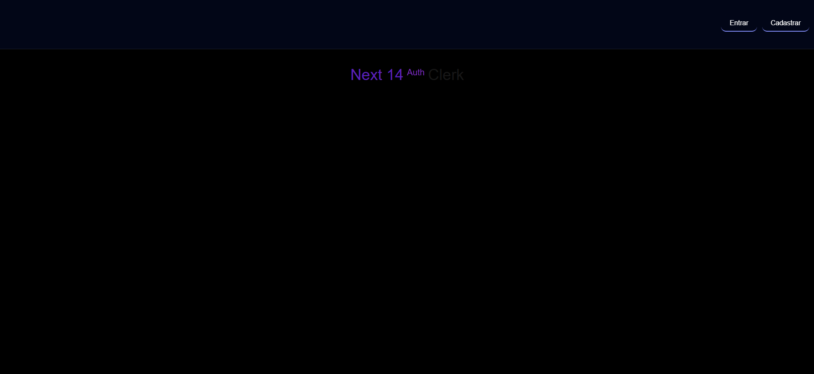
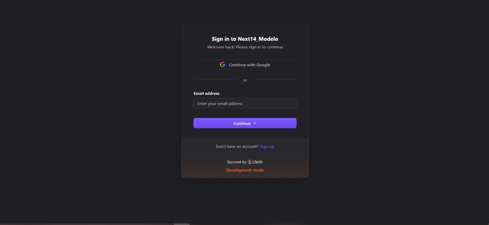
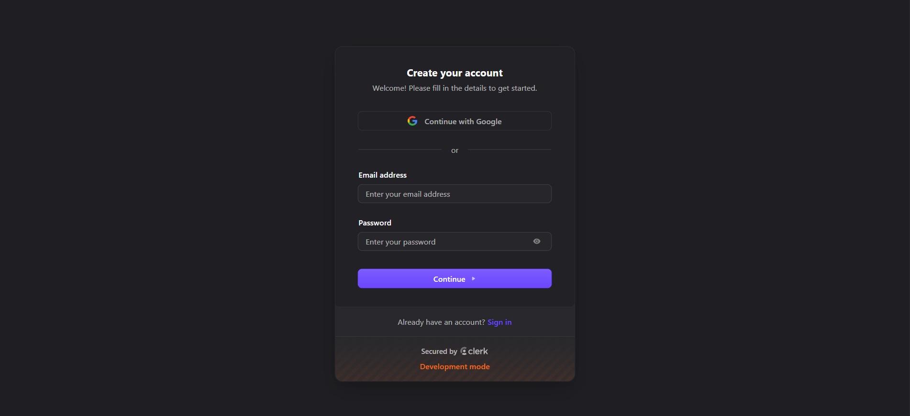
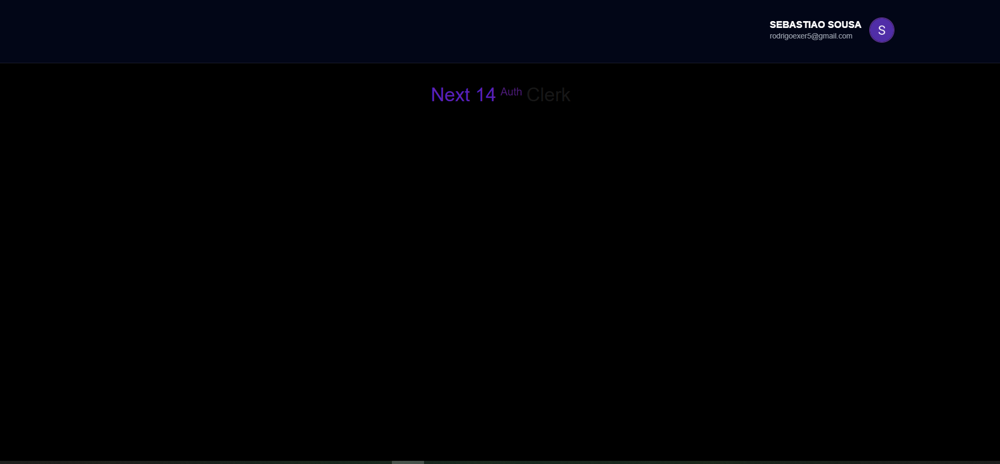

# 🔐 Next 14 Auth – Clerk + Tailwind + Motion

<div align="center">

[]()
[]()
[]()
[]()
[]()

</div>

---

## ✨ Sobre o Projeto

Este projeto é uma base moderna para **autenticação com Next.js 14**, utilizando:

- 🔐 **Clerk** para login, cadastro e gerenciamento de usuários  
- 🎨 **TailwindCSS + Tailwind Forms** para UI responsiva e elegante  
- 🎞️ **Framer Motion** para animações suaves  
- 🧩 **Heroicons** para ícones otimizados  
- 🌀 **tailwind-merge** para controle inteligente de classes  

Perfeito para quem deseja iniciar rapidamente um sistema com **auth completa**, layout profissional e código escalável.

---

## 🚀 Tecnologias Utilizadas

- **Next.js 14 (App Router)**
- **@clerk/nextjs**
- **framer-motion**
- **heroicons/react**
- **tailwindcss/forms**
- **tailwind-merge**

---

## 📸 Telas do Projeto

### 🏠 Home Page
<div align="center">
  
</div>

---

### 🔑 Login Page
<div align="center">
  
</div>

---

### 📝 Cadastro Page
<div align="center">
  
</div>

---

### 🧭 Painel Autenticado
<div align="center">
  
</div>

---
## 🛠️ Como Rodar o Projeto
```bash
# Instalar dependências
npm install

# Rodar o servidor de desenvolvimento
npm run dev


# Gerar build para produção
npm run build

📁 Estrutura do Projeto
/
├─ app/
│  ├─ (public)/
│  ├─ (auth)/
│  ├─ layout.tsx
│  └─ page.tsx
├─ components/
├─ hooks/
├─ lib/
├─ styles/
└─ public/

🌟 Funcionalidades

Cadastro, login e logout com Clerk

Redirecionamento automático após autenticação

Componentes animados com Framer Motion

Formulários estilizados com Tailwind Forms

Ícones otimizados via Heroicons

Sistema completo pronto para expansão

🚧 Melhorias Futuras

Dark mode 🌙

Página de perfil do usuário

Gerenciamento de permissões

Dashboard completo

API com ações protegidas

👤 Autor
Sebastião Rodrigo
